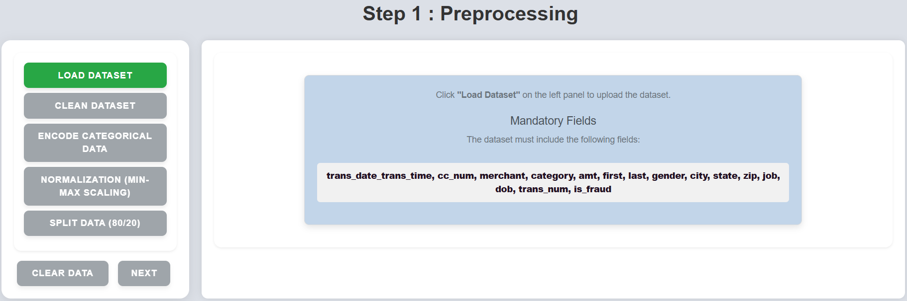
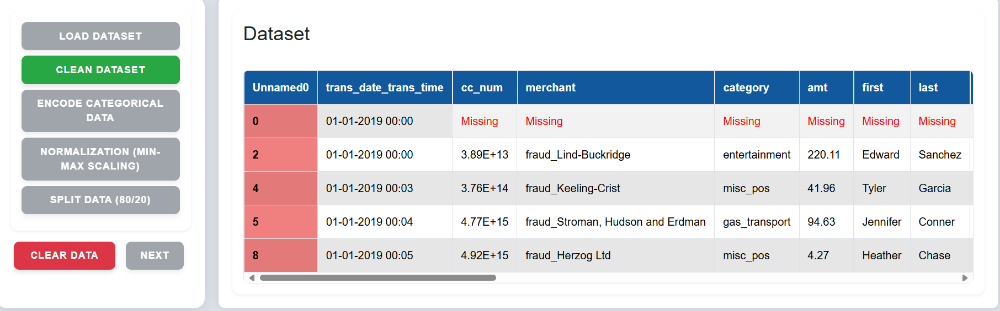
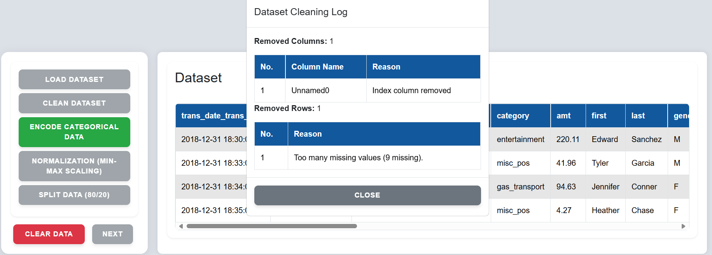
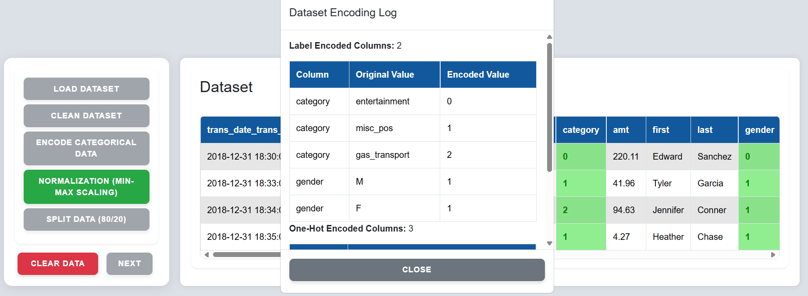
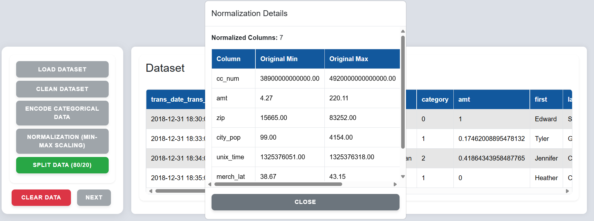
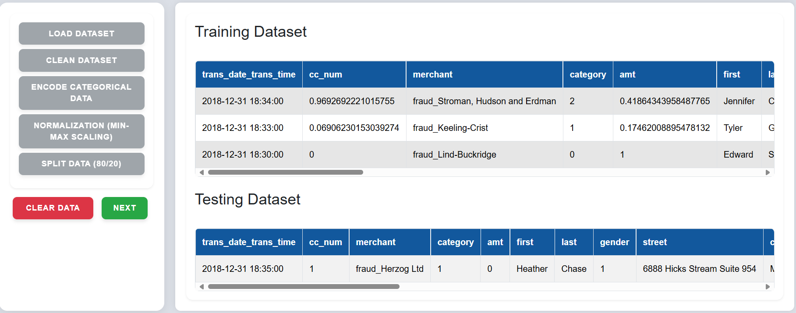
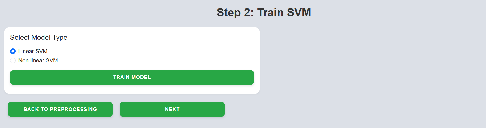
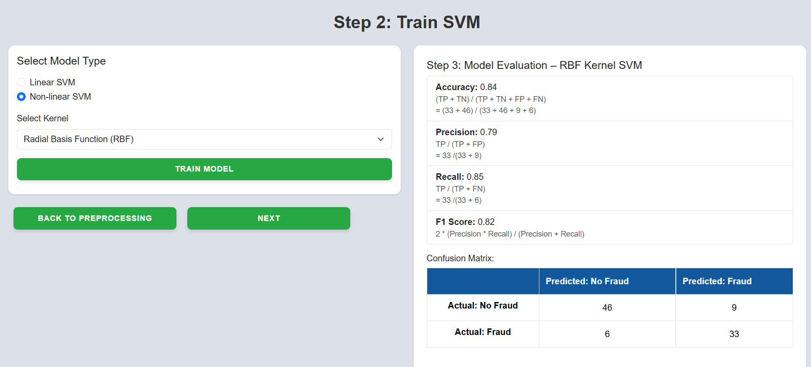
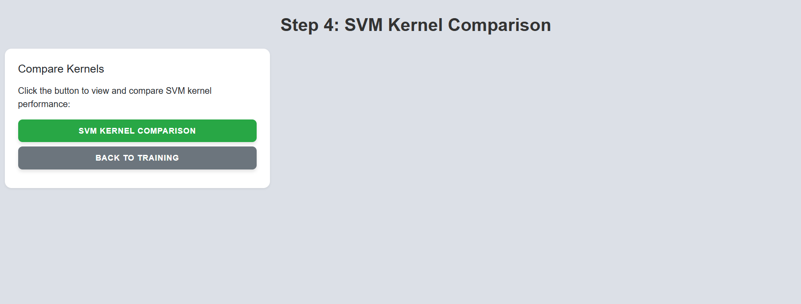
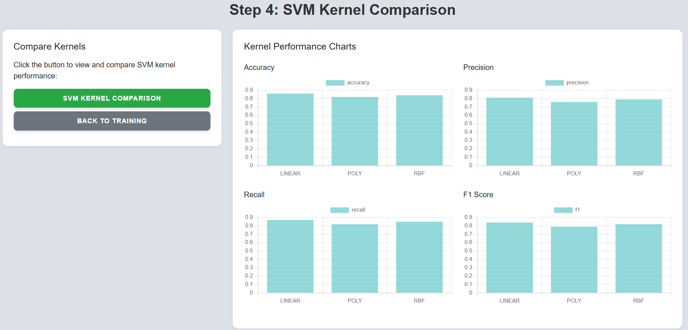

**Step 1:** Click on **"Load Dataset"** on the left panel to upload the dataset.  

  
&nbsp;

**Step 2:** The interface will highlight missing values and unwanted rows.  

  
&nbsp;

**Step 3:** Click on **"Clean Dataset"** to remove red-highlighted rows and handle missing values.  

  
&nbsp;

**Step 4:** Click on **"Encode Categorical Data"** to convert non-numeric fields into numeric codes using label encoding or one-hot encoding.  

  
&nbsp;

**Step 5:** Click on **"Normalization (Min-Max Scaling)"** to scale numeric data to the range $[0, 1]$.  

  
&nbsp;

**Step 6:** Click on **"Split Data (80/20)"** to divide the dataset into 80% training and 20% testing sets.  

  
&nbsp;

**Step 7:** Click on **"Next"** to go to the Train SVM section.  

  
&nbsp;

**Step 8:** Select the desired **model type** and click on **"Train Model"**.  

  
&nbsp;

**Step 9:** Click on the **"Next"** button to proceed to the SVM Kernel Comparison section.  

  
&nbsp;

**Step 10:** Click on **"SVM Kernel Comparison"** to view performance across different kernels.  

  
&nbsp;